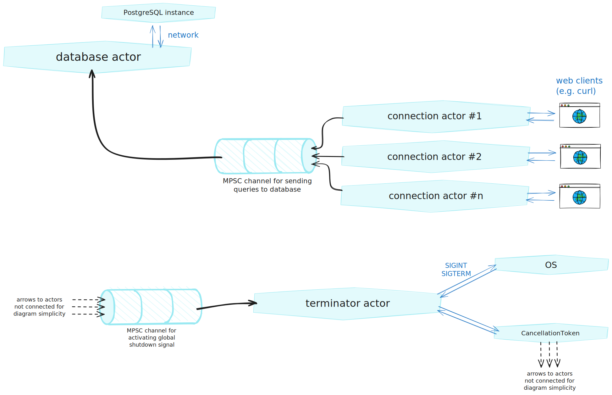

Proof-of-concept implementation demonstrating:

- HTTP JSON API with ergonomics of _serde_ ecosystem and _axum_

- CRUD operations on PostgreSQL with ergonomics of _diesel_

- Using _actor pattern_ in _tokio_ ecosystem (inspired by Alice Ryhl: _Actors
  with Tokio_, RustLab Conference 2022)

### Actor pattern

Actor pattern is a useful idea when we want to clearly define which component
in a concurrent program's architecture owns each specific I/O resource. More
generally, some fundamental characteristics of actors are:

- **Each actor is the sole owner of something** (a network socket, an opened
  file, or whatever).

  This is particularly useful to keep in mind when designing software that is
  implemented in Rust because as a language it has strong ownership semantics.

- **Actors communicate with each other.**

  The the communication primitives may be provided by the platform (operating
  system) or some other framework (some library).

- **All actors may perform their own independent workloads concurrently.**

  For example, a web server actor may keep accepting network connections at the
  same time as a program termination actor keeps listening for a termination
  signal from the operating system.

- **Actors may create new actors.**

  For example, a web server actor that accepts network connections may create
  actors that are responsible for a single established connection.

### Diagram of the actors

- The **database actor** owns the I/O resources of the connection established
  to a PostgreSQL instance. In the proof-of-concept implementation, the actor is
  `db::Actor` defined in [`./src/db/mod.rs`](./src/db/mod.rs).

- Each **connection actor** owns the I/O resources of a single inbound web
  request.

  In the proof-of-concept implementation, connection actors are the
  individual functions in module web::handlers::books_v1, which is defined in
  [`./src/web/handlers/books_v1.rs`](./src/web/handlers/books_v1.rs).

  Connection actors are created by a web server that accepts connections.
  The web server can also be thought of as an actor, and it's defined in
  [`./src/web/mod.rs`](./src/web/mod.rs).

- The **terminator actor** owns a global shutdown signal. All other actors are
  connected to the terminator such that they only perform their jobs until the
  global shutdown signal is activated.

  Some actors are also connected to the terminator such that they can
  activate the global shutdown signal. Intent is that the whole program's
  graceful shutdown can be initiated by any of the essential actors in case a
  non-recoverable error occurs.

  Terminator also listens for the standard OS level termination signals
  (`SIGINT`, `SIGTERM`).



### Usage

```console
cargo run
```

### Cheatsheet

- Starting a containerized PostgreSQL instance (using Podman v4.3.1):

  ```console
  podman run --rm \
    --name poc-postgres \
    -e POSTGRES_PASSWORD=postgres \
    -p 127.0.0.1:5432:5432/tcp \
    docker.io/library/postgres:17.6-trixie@sha256:feff5b24fedd610975a1f5e743c51a4b360437f4dc3a11acf740dcd708f413f6
  ```

- Creating a table named `books` in the containerized PostgreSQL instance:

  ```console
  podman exec -it poc-postgres psql -U postgres -d postgres -c '
    CREATE TABLE books (
      id    UUID PRIMARY KEY,
      title VARCHAR NOT NULL
    );'
  ```

- POST a book:

  ```console
  curl http://127.0.0.1:8080/api/books/v1 --json '{"id":"00000000-0000-0000-0000-000000000000","title":"Foo Bar!"}'
  ```

- GET books:

  ```console
  curl http://127.0.0.1:8080/api/books/v1
  ```

  ```json
  [{ "id": "00000000-0000-0000-0000-000000000000", "title": "Foo Bar!" }]
  ```
